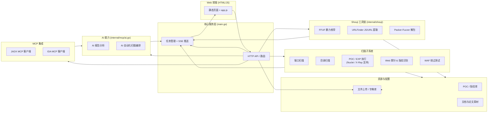

# NeonScan 功能模块概览

NeonScan 是一个整合多种安全扫描、AI 分析与逆向辅助能力的 Go 后端项目，配套简洁的前端页面及外部工具集成。整体可分为以下核心模块：

- **核心服务层**：`main.go` 提供 HTTP API、任务管理、SSE 实时推送以及静态资源服务。
- **扫描子系统**：内建端口扫描、目录爆破、POC/EXP 验证、Web 指纹探测、WAF 绕过等功能，复用统一 Task+SSE 框架。
- **Shouji 工具链**：通过 `internal/shouji` 调用 FFUF、URLFinder、Packer-Fuzzer 等第三方工具，扩展 JS/URL 信息收集与解包能力。
- **AI 能力**：`/ai/analyze` 与 `/ai/auto-scan` 结合 OpenAI、DeepSeek、Anthropic、Ollama 等 Provider，实现报告分析与自动化扫描编排。
- **MCP 集成**：`internal/mcp` 与 JADX / IDA Pro 的 MCP 服务器交互，支持逆向分析过程中的 AI 辅助。
- **资源管理**：统一文件上传、字典/POC 仓库、报告材料与前端静态页面。

下面的模块框图描述主要组件与数据流向：

## 模块要点

- **核心服务层**：负责请求解析、参数校验、并发控制以及与前端的实时通信；所有长任务都通过 `Task` 结构统一管理。
- **扫描子系统**：每类扫描均支持并发、任务停止、结果推送，并可复用上传的自定义字典/POC 文件；POC 模块兼容传统、X-Ray 以及 Nuclei 子集。
- **Shouji 工具链**：提供 REST 接口触发外部二进制或 Python 工具，解析其运行结果并合并到系统输出。
- **AI 能力**：通过 MCP Provider 抽象封装四种主流模型；自动扫描会根据过去扫描结果组合新的任务流。
- **MCP 集成**：负责与逆向工具的 HTTP/SSE 通道交互，管理会话、工具列表、函数调用与消息缓存。
- **资源管理**：`uploads/` 按时间戳归档用户上传的字典与 POC，`library/` 保存内置指纹库，`web/` 提供前端入口，`shili/` 储存论文与配套图文。

该框图可作为项目整体介绍稿或论文材料的功能模块示意。若需更精细的流程/交互图，可在此基础上扩展对应模块的内部结构。

