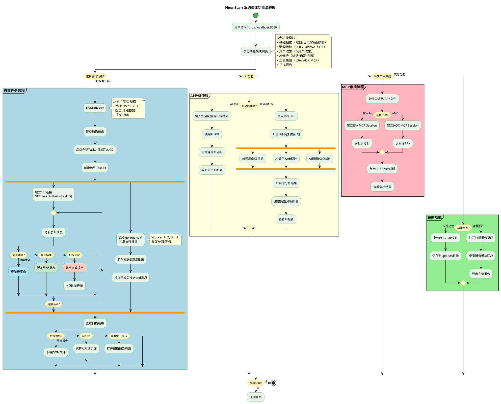
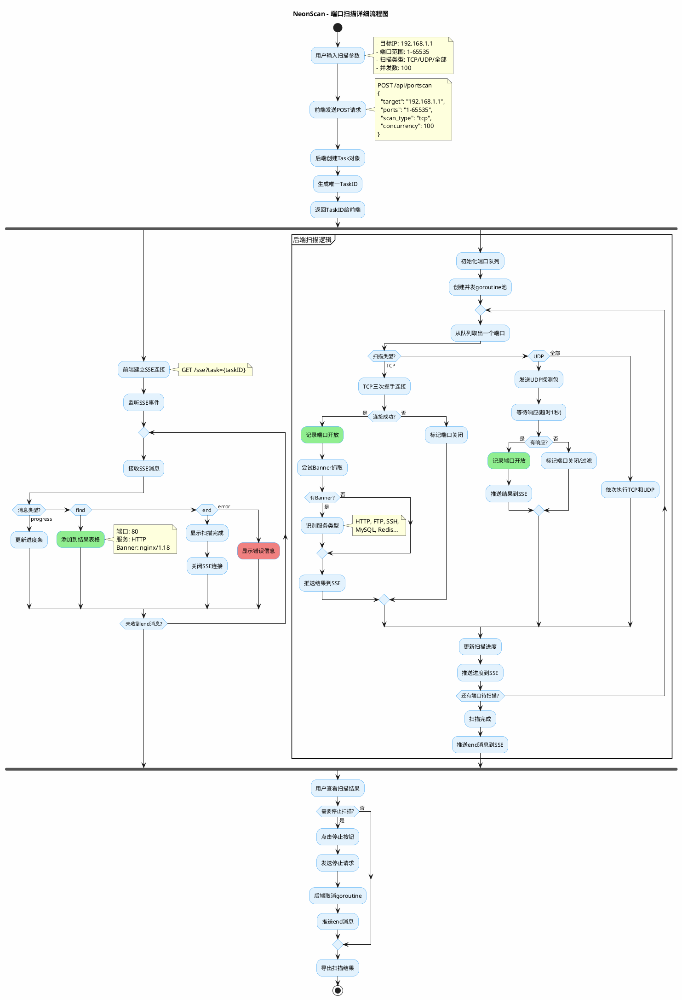
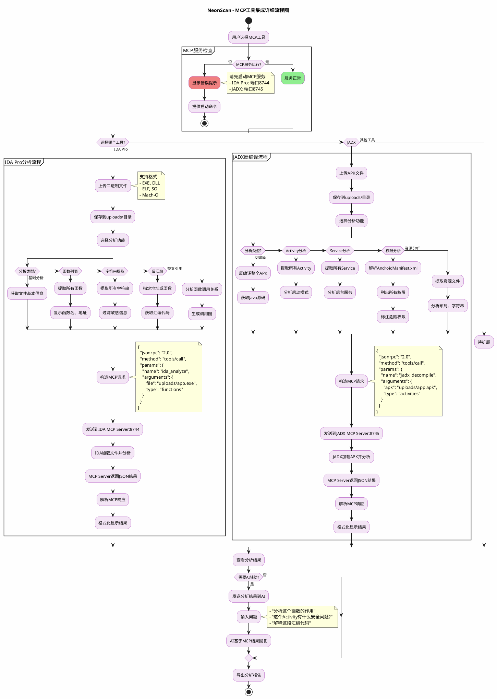
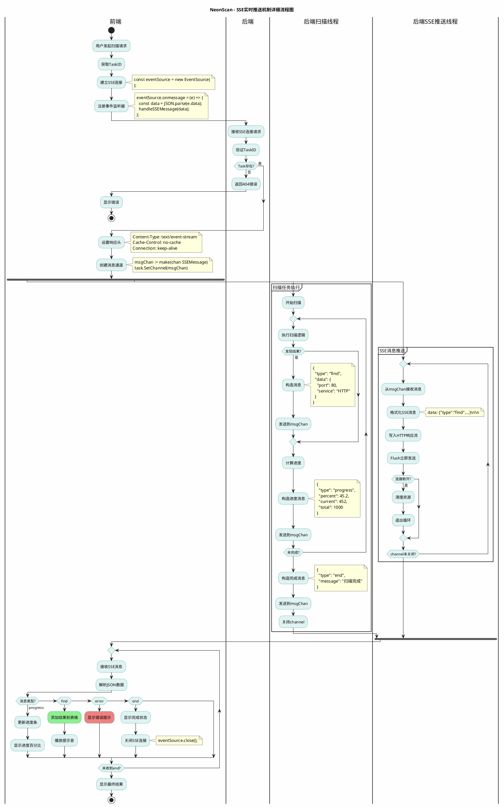
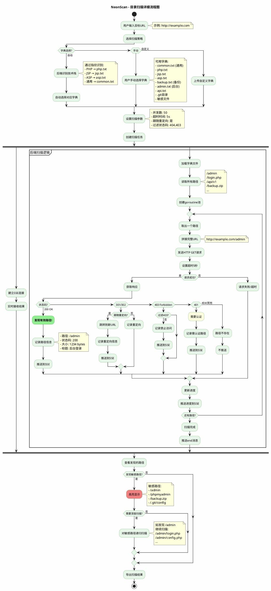

# NeonScan 功能流程图

本文档包含NeonScan系统的核心功能流程图，使用PlantUML绘制。

---

## 1. 系统整体功能流程图



---

## 2. 端口扫描详细流程图



---

## 3. POC漏洞扫描流程图

```plantuml
@startuml POC漏洞扫描流程图

skinparam backgroundColor #FEFEFE
skinparam activityBackgroundColor #FFEBEE
skinparam activityBorderColor #F44336

title NeonScan - POC漏洞扫描详细流程图

start

:用户选择POC扫描;

partition "POC准备" {
    :选择POC来源;
    
    if (POC来源?) then (本地目录)
        :浏览本地POC目录;
        :选择POC文件/文件夹;
    elseif (单个POC) then
        :上传单个POC文件;
    else (在线POC库)
        :从POC库选择;
    endif
    
    :后端加载POC文件;
    
    :识别POC格式;
    note right
      - 传统JSON格式
      - X-Ray YAML格式
      - Nuclei YAML格式
    end note
}

partition "POC解析" {
    if (POC格式?) then (传统JSON)
        :解析JSON结构;
        :提取name, method, path;
        :提取headers, body;
        :提取匹配规则;
        
    elseif (X-Ray YAML) then
        :解析YAML结构;
        :初始化表达式引擎;
        :解析rules规则;
        :解析expression表达式;
        
    else (Nuclei YAML)
        :解析YAML结构;
        :提取requests模板;
        :提取matchers匹配器;
        :提取extractors提取器;
    endif
}

:输入目标URL;
note right
  单个: http://example.com
  批量: 上传URL列表
end note

:创建扫描任务;
:计算总任务数 = POC数 × URL数;

fork
    :建立SSE连接;
    :实时接收扫描结果;
    
fork again
    partition "后端并发扫描" {
        :创建goroutine池;
        
        repeat
            :取出一个POC和URL组合;
            
            :构造HTTP请求;
            note right
              根据POC定义:
              - 设置Method
              - 设置Headers
              - 设置Body
              - 设置超时时间
            end note
            
            :发送HTTP请求;
            
            if (请求成功?) then (是)
                :获取响应;
                
                partition "漏洞匹配" {
                    if (POC类型?) then (传统)
                        :检查响应状态码;
                        :检查响应头;
                        :检查响应体关键字;
                        
                    elseif (X-Ray) then
                        :执行expression表达式;
                        :r1 = 响应包含特征;
                        :r2 = 状态码匹配;
                        :计算: r1() && r2();
                        
                    else (Nuclei)
                        :执行matchers匹配;
                        :检查word匹配;
                        :检查regex匹配;
                        :检查status匹配;
                        :检查dsl匹配;
                    endif
                    
                    if (匹配成功?) then (是)
                        #LightCoral:**发现漏洞!**;
                        :记录漏洞详情;
                        note right
                          - POC名称
                          - 漏洞类型
                          - 危险等级
                          - 匹配内容
                          - 请求/响应
                        end note
                        :推送到SSE;
                    else (否)
                        :记录无漏洞;
                    endif
                }
                
            else (否)
                :记录请求失败;
            endif
            
            :更新进度;
            :推送进度到SSE;
            
        repeat while (还有POC待测试?)
        
        :扫描完成;
        :推送end消息;
    }
end fork

:查看漏洞列表;

if (发现漏洞?) then (是)
    :查看漏洞详情;
    
    if (需要EXP验证?) then (是)
        :加载对应EXP;
        :执行漏洞利用;
        :查看利用结果;
    else (否)
    endif
    
    if (需要AI分析?) then (是)
        :发送漏洞信息到AI;
        :获取修复建议;
    else (否)
    endif
    
else (否)
    :显示无漏洞;
endif

:导出扫描报告;

stop

@enduml
```



---

## 4. AI安全对话流程图

```plantuml
@startuml AI安全对话流程图

skinparam backgroundColor #FEFEFE
skinparam activityBackgroundColor #FFF9C4
skinparam activityBorderColor #FBC02D

title NeonScan - AI安全对话详细流程图

start

:用户进入AI对话页面;

partition "AI配置检查" {
    if (已配置AI Provider?) then (否)
        :显示配置页面;
        :选择AI Provider;
        note right
          - OpenAI (GPT-4o)
          - DeepSeek
          - Anthropic (Claude)
          - Ollama (本地)
        end note
        :输入API密钥;
        :保存配置;
    else (是)
    endif
}

:用户输入问题;
note right
  示例问题:
  - "分析这个SQL注入漏洞"
  - "帮我审计这段代码"
  - "解释这个POC的原理"
  - "用IDA分析这个二进制"
end note

:前端发送聊天请求;
note right
  POST /api/ai/chat
  {
    "message": "分析漏洞",
    "provider": "openai",
    "context": {...}
  }
end note

fork
    :建立SSE连接接收回复;
    
    repeat
        :接收SSE消息;
        
        if (消息类型?) then (token)
            :逐字显示AI回复;
            
        elseif (tool_call) then
            #LightBlue:显示工具调用状态;
            note right
              "AI正在调用工具:
              POC扫描..."
            end note
            
        elseif (tool_result) then
            :显示工具返回结果;
            
        else (end)
            :对话完成;
        endif
        
    repeat while (未收到end?)
    
fork again
    partition "后端AI处理" {
        :构造ChatMessage;
        :添加系统提示词;
        note right
          你是安全测试专家,
          可以使用工具:
          - POC扫描
          - 端口扫描
          - IDA分析
          - JADX分析
        end note
        
        :调用AI Provider API;
        
        if (Provider类型?) then (OpenAI)
            :调用OpenAI API;
            :gpt-4o模型;
            
        elseif (DeepSeek) then
            :调用DeepSeek API;
            :deepseek-chat模型;
            
        elseif (Anthropic) then
            :调用Anthropic API;
            :claude-3.5-sonnet;
            
        else (Ollama)
            :调用本地Ollama;
            :qwen2.5:7b模型;
        endif
        
        :获取流式响应;
        
        repeat
            :接收Token;
            :推送Token到SSE;
            
            if (检测到工具调用?) then (是)
                :暂停Token推送;
                :解析工具调用参数;
                
                if (工具类型?) then (poc_scan)
                    :执行POC扫描;
                    :获取扫描结果;
                    
                elseif (port_scan) then
                    :执行端口扫描;
                    :获取扫描结果;
                    
                elseif (ida_analyze) then
                    :调用IDA MCP服务;
                    :获取分析结果;
                    
                elseif (jadx_decompile) then
                    :调用JADX MCP服务;
                    :获取反编译结果;
                    
                else (code_audit)
                    :执行代码审计;
                    :获取审计报告;
                endif
                
                :推送工具调用状态;
                :推送工具返回结果;
                
                :将结果返回给AI;
                :AI基于结果继续回复;
                
            else (否)
            endif
            
        repeat while (还有Token?)
        
        :推送end消息;
    }
end fork

:查看完整对话;

if (需要导出对话?) then (是)
    :导出Markdown格式;
    :保存到本地;
else (否)
endif

if (需要继续对话?) then (是)
    :输入新问题;
    backward:添加到对话历史;
else (否)
endif

stop

@enduml
```

---

## 5. MCP工具集成流程图



---

## 6. SSE实时推送机制流程图



---

## 7. 目录扫描流程图



---

## 使用说明

### 在线渲染这些流程图

#### 方式1: PlantUML在线编辑器
1. 访问 https://www.plantuml.com/plantuml/uml/
2. 复制上面任意一个流程图代码
3. 粘贴后自动生成图片
4. 右键保存图片

#### 方式2: VS Code插件
```bash
# 1. 安装插件
搜索并安装 "PlantUML"

# 2. 预览
打开本文件
按 Alt+D 预览
```

#### 方式3: 导出图片
```bash
# 安装PlantUML
java -jar plantuml.jar NeonScan功能流程图.md

# 批量生成PNG图片
```

---

## 流程图说明

### 1. 系统整体流程图
- **用途**: 展示NeonScan的整体功能架构
- **适用场景**: 答辩开场、论文系统设计章节
- **核心要素**: 6大功能模块、任务执行流程、结果处理

### 2. 端口扫描流程图
- **用途**: 详细展示端口扫描的完整流程
- **技术亮点**: SSE实时推送、TCP/UDP双协议、Banner抓取
- **适用场景**: 技术实现章节、核心功能讲解

### 3. POC漏洞扫描流程图
- **用途**: 展示3种POC格式的解析和匹配流程
- **技术亮点**: 支持传统/X-Ray/Nuclei格式、智能匹配引擎
- **适用场景**: 创新点讲解、漏洞检测模块说明

### 4. AI安全对话流程图
- **用途**: 展示AI集成和工具调用流程
- **技术亮点**: 多Provider支持、工具调用机制、流式推送
- **适用场景**: AI模块讲解、创新点展示

### 5. MCP工具集成流程图
- **用途**: 展示IDA Pro和JADX集成的详细流程
- **技术亮点**: MCP协议、专业工具联动、二进制/APK分析
- **适用场景**: 高级功能讲解、扩展性展示

### 6. SSE实时推送机制流程图
- **用途**: 深入展示SSE的前后端交互细节
- **技术亮点**: 双向通信、goroutine并发、实时更新
- **适用场景**: 技术实现细节、性能优化讲解

### 7. 目录扫描流程图
- **用途**: 展示智能字典选择和目录扫描流程
- **技术亮点**: 自动识别技术栈、9大分类字典、递归扫描
- **适用场景**: Web扫描模块讲解

---

## 答辩展示建议

### PPT使用方案

```
第1页: 标题页
  "NeonScan - AI驱动的安全测试工具"

第2页: 系统整体流程图
  - 展示6大功能模块
  - 讲解整体架构设计

第3页: 核心技术 - SSE实时推送
  - 使用SSE实时推送流程图
  - 对比传统轮询方式
  - 强调技术优势

第4页: 基础扫描功能
  - 端口扫描流程图
  - 目录扫描流程图
  - 展示并发性能

第5页: 漏洞检测功能
  - POC漏洞扫描流程图
  - 强调3种POC格式支持
  - 展示漏洞匹配引擎

第6页: AI智能分析
  - AI安全对话流程图
  - 展示工具调用机制
  - 强调4种Provider支持

第7页: MCP工具集成
  - MCP工具集成流程图
  - 展示专业工具联动
  - 体现扩展性设计

第8页: 技术总结
  - 核心技术对比表
  - 创新点汇总
```

### 讲解话术模板

#### 开场（系统整体流程图）
> "各位老师，这是NeonScan的系统整体流程图。用户启动工具后，可以选择6大功能模块：端口扫描、目录扫描、POC漏洞扫描、AI安全对话、MCP工具集成和Web探针。每个功能都基于**任务-SSE推送-结果处理**的统一架构，保证了系统的一致性和可维护性。"

#### 技术亮点（SSE流程图）
> "这张图展示了SSE实时推送的完整机制。前端建立EventSource连接后，后端通过goroutine并发执行扫描任务，扫描结果通过channel传递到SSE推送线程，实现**毫秒级**的进度更新。相比传统的轮询方式，SSE减少了90%的无效请求，大幅提升了用户体验。"

#### 创新功能（POC扫描流程图）
> "POC漏洞扫描是系统的核心功能之一。我们支持**3种主流POC格式**：传统JSON格式、X-Ray的YAML格式和Nuclei格式。通过统一的解析引擎和智能匹配机制，用户可以直接使用GitHub上的开源POC库，大大降低了使用门槛。"

#### 高级特性（AI+MCP流程图）
> "AI安全对话模块是本系统的最大创新点。用户提问后，AI不仅能回答问题，还能**主动调用系统工具**，比如执行POC扫描、调用IDA分析二进制文件。这种**AI+工具联动**的方式，让安全测试从手工操作变成了智能对话，极大提升了测试效率。"

---

## 论文写作建议

### 第3章 需求分析
引用: **系统整体流程图**
```
图3.1 NeonScan系统整体功能流程图

如图3.1所示，系统采用模块化设计，包含6大功能模块...
```

### 第4章 系统设计
引用: **SSE实时推送机制流程图**
```
图4.2 SSE实时推送机制设计

系统采用SSE技术实现实时推送，如图4.2所示，前端通过EventSource建立连接...
```

### 第5章 详细设计与实现

#### 5.1 端口扫描模块
引用: **端口扫描流程图**
```
图5.1 端口扫描详细流程图

端口扫描模块的实现流程如图5.1所示，首先用户输入扫描参数...
```

#### 5.2 POC漏洞检测模块
引用: **POC漏洞扫描流程图**
```
图5.3 POC漏洞扫描流程图

POC漏洞检测模块支持3种主流格式，如图5.3所示...
```

#### 5.3 AI智能分析模块
引用: **AI安全对话流程图**
```
图5.5 AI安全对话流程图

AI模块的核心是工具调用机制，如图5.5所示...
```

#### 5.4 MCP工具集成模块
引用: **MCP工具集成流程图**
```
图5.7 MCP工具集成流程图

系统通过MCP协议集成专业工具，如图5.7所示...
```

---

## 流程图特点总结

### ✅ 7个核心流程图
1. **系统整体流程图** - 宏观架构
2. **端口扫描流程图** - 基础功能
3. **POC漏洞扫描流程图** - 核心功能
4. **AI安全对话流程图** - 创新功能
5. **MCP工具集成流程图** - 高级功能
6. **SSE实时推送流程图** - 技术细节
7. **目录扫描流程图** - 完整功能

### ✅ 覆盖所有核心模块
- 基础扫描 ✓
- 漏洞检测 ✓
- AI分析 ✓
- MCP集成 ✓
- 实时推送 ✓

### ✅ 适用多个场景
- 毕业答辩PPT
- 毕业论文插图
- 技术文档
- 开发参考

---

需要我帮你进一步优化这些流程图，或者绘制其他类型的UML图（如时序图、类图、部署图）吗？
