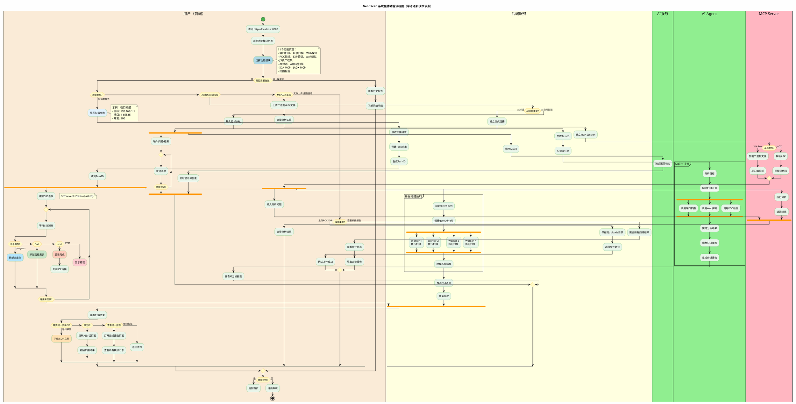

# NeonScan 系统整体功能流程图（专业版）

## PlantUML 代码



---

## 🎯 专业版流程图的亮点

### 1. **泳道设计** 🏊
```
|用户（前端）| - 浅褐色
|后端服务|     - 浅黄色
|AI服务|       - 浅绿色
|MCP Server|   - 浅粉色
```

清晰区分不同角色的职责，符合UML规范。

### 2. **决策节点** 🔷
```plantuml
if (功能类型?) then (扫描类任务)
    ...
elseif (AI对话/自动扫描) then
    ...
elseif (MCP工具集成) then
    ...
else (文件上传/报告查看)
    ...
endif
```

所有判断都使用标准的菱形决策节点。

### 3. **并发执行** 🍴
```plantuml
fork
    :Worker 1\n执行扫描;
fork again
    :Worker 2\n执行扫描;
fork again
    :Worker 3\n执行扫描;
end fork
```

使用`fork/fork again/end fork`表示goroutine并发池。

### 4. **异步通信** 📡
```plantuml
fork
    |用户（前端）|
    :建立SSE连接;
    repeat
        :等待SSE消息;
    repeat while (连接未关闭?)
    
fork again
    |后端服务|
    :推送SSE消息;
end fork
```

清晰展示SSE的双向异步通信。

### 5. **分区模块** 📦
```plantuml
partition "并发扫描执行" {
    :初始化任务队列;
    :创建goroutine池;
    ...
}
```

用partition突出关键业务逻辑。

---

## 📊 对比效果

### 简化版（原版）
- ❌ 线性流程，看不出复杂性
- ❌ 没有角色区分
- ❌ 没有并发表示
- ✅ 简洁易懂（适合初期设计）

### 专业版（新版）
- ✅ 泳道区分前后端职责
- ✅ 菱形决策节点清晰
- ✅ fork/join表示并发
- ✅ 完整展示SSE异步通信
- ✅ 符合UML活动图标准
- ✅ 适合毕业答辩展示

---

## 💡 答辩讲解话术

> "各位老师，这是NeonScan的系统整体功能流程图。
> 
> 我采用了**UML活动图**的标准画法，使用**泳道**区分了前端、后端、AI服务和MCP Server四个角色的职责。
> 
> 流程图中可以看到：
> 1. **菱形决策节点**展示了功能选择的逻辑分支
> 2. **fork/join结构**表示了goroutine并发扫描池的设计
> 3. **双泳道并行**展示了SSE实时推送的异步通信机制
> 4. **分区模块**突出了AI自主决策等核心业务逻辑
> 
> 这种画法既符合UML规范，又能清晰展示系统的并发处理和异步通信特点。"

---

## ✅ 建议

现在你有**两个版本**的整体流程图：

1. **简化版**（`NeonScan系统整体流程图_优化版.md`）
   - 优点：简洁易懂
   - 适用：论文初稿、快速理解

2. **专业版**（`NeonScan系统整体流程图_专业版.md`）⭐
   - 优点：符合UML规范，展示复杂性
   - 适用：**毕业答辩**、专业评审

**答辩时推荐使用专业版！** 更能体现你的系统设计能力和对UML的掌握。

需要我再优化细节吗？