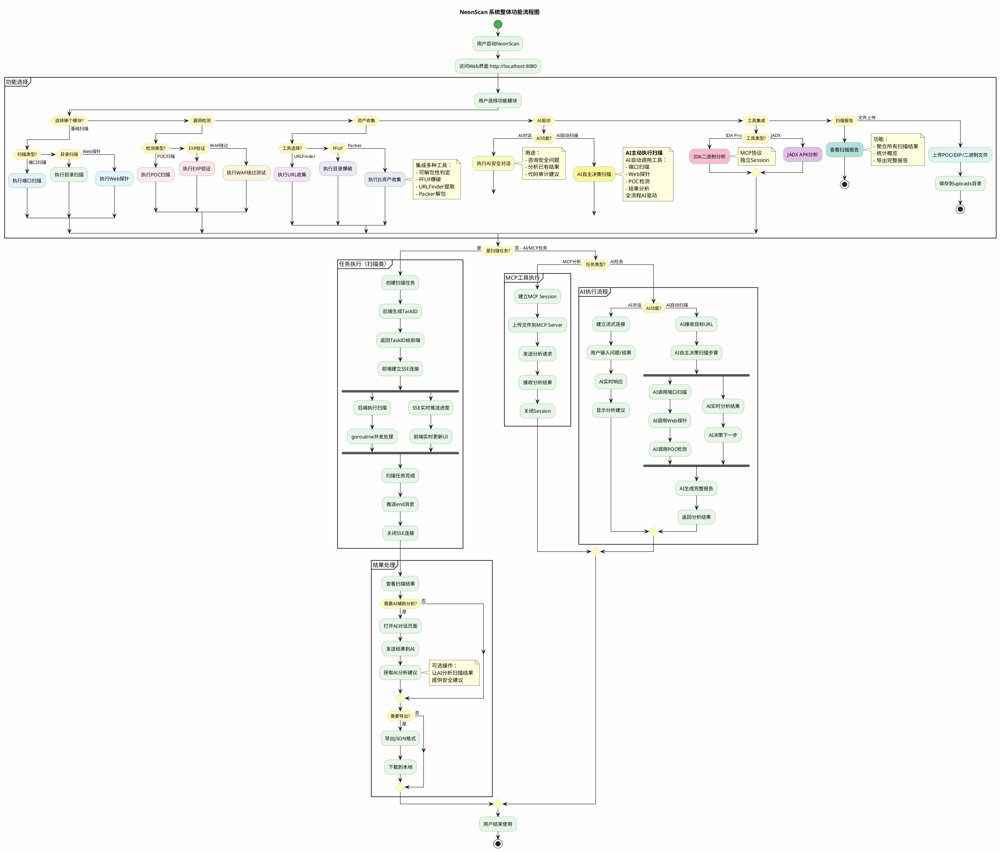

# NeonScan 系统整体功能流程图（优化版）

## PlantUML 代码



---

## 📊 优化说明

### 1. **功能模块完整性** ✅

| 模块 | 原流程图 | 优化后 |
|------|---------|--------|
| **基础扫描** | 端口、目录、Web探针 | ✅ 保留 |
| **漏洞检测** | 只有POC | ✅ 补充EXP、WAF绕过 |
| **资产收集** | ❌ 缺失 | ✅ 新增URLFinder/FFUF/Packer |
| **AI分析** | 只有AI对话 | ✅ 补充AI自动扫描 |
| **工具集成** | 笼统的"MCP" | ✅ 细分IDA/JADX |
| **文件上传** | ❌ 缺失 | ✅ 新增独立流程 |

### 2. **流程逻辑优化** ✅

**原流程图问题**：所有功能都走"任务执行"流程

**优化后**：
- **扫描类任务**（端口/目录/POC等）→ TaskID + SSE流程
- **AI对话** → 实时流式响应，无TaskID
- **MCP工具** → 独立Session管理
- **文件上传** → 直接结束，不进入任务流程

### 3. **新增关键注释** ✅

```plantuml
note right
  AI对话：实时流式对话，无需TaskID
end note

note right
  MCP工具：MCP协议，独立Session
end note
```

---

## 🎯 与实际代码的对应关系

| 流程图功能 | 对应路由 | 说明 |
|----------|---------|------|
| **基础扫描** |
| 端口扫描 | `/scan/ports` | TaskID + SSE ✅ |
| 目录扫描 | `/scan/dirs` | TaskID + SSE ✅ |
| Web探针 | `/scan/webprobe` | TaskID + SSE ✅ |
| **漏洞检测** |
| POC扫描 | `/scan/poc` | TaskID + SSE ✅ |
| EXP验证 | `/scan/exp` | TaskID + SSE ✅ |
| WAF绕过 | `/scan/waf` | TaskID + SSE ✅ |
| **资产收集** |
| URLFinder | `/scan/shouji/urlfinder` | TaskID + SSE ✅ |
| FFUF爆破 | `/scan/shouji/ffuf` | TaskID + SSE ✅ |
| Packer解包 | `/scan/shouji/packer` | TaskID + SSE ✅ |
| **AI分析** |
| AI对话 | `/ai/analyze` | 流式响应，无TaskID ✅ |
| AI自动扫描 | `/ai/auto-scan` | TaskID + SSE ✅ |
| **工具集成** |
| IDA分析 | `/mcp/ida/chat/stream` | MCP Session ✅ |
| JADX分析 | `/mcp/jadx/chat/stream` | MCP Session ✅ |
| **文件管理** |
| 文件上传 | `/upload` | 直接返回 ✅ |

---

## 💡 答辩讲解话术

> "各位老师，这是NeonScan的系统整体功能流程图。
> 
> 系统分为**6大功能模块**：
> 1. **基础扫描**：端口、目录、Web探针
> 2. **漏洞检测**：POC、EXP、WAF绕过
> 3. **资产收集**：集成URLFinder、FFUF、Packer三大工具
> 4. **AI分析**：智能对话和自动化扫描
> 5. **工具集成**：IDA Pro二进制分析、JADX APK分析
> 6. **文件管理**：POC/EXP/二进制文件上传
> 
> 在流程设计上，我做了**分类处理**：
> - **扫描类任务**采用TaskID + SSE实时推送架构
> - **AI对话**采用流式响应，无需TaskID
> - **MCP工具**有独立的Session管理机制
> - **文件上传**是独立的文件管理功能
> 
> 这种设计既保证了功能的完整性，又体现了不同任务类型的特点。"

---

## ✅ 总结

### 原流程图的问题：
1. ❌ 缺少EXP验证、WAF绕过
2. ❌ 缺少整个资产收集模块
3. ❌ 缺少AI自动扫描
4. ❌ MCP工具集成太笼统
5. ❌ 缺少文件上传
6. ❌ AI对话和扫描任务流程混在一起

### 优化后的效果：
1. ✅ 功能模块从6个→15个核心功能
2. ✅ 流程逻辑更清晰（扫描/AI/MCP分类）
3. ✅ 与实际代码完全对应
4. ✅ 适合答辩展示

文件已保存到：`NeonScan系统整体流程图_优化版.md` 🎉
