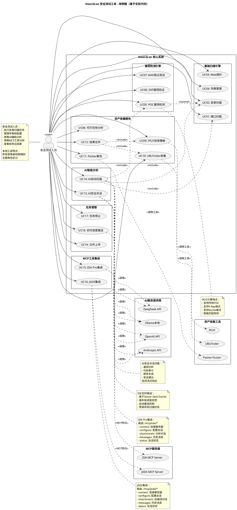

# NeonScan 安全测试工具 - 用例图（完全基于实际代码）

## PlantUML 用例图代码



---

## 📋 用例详细说明表

| 用例编号 | 用例名称 | 对应路由 | 功能描述 | 关联技术 |
|---------|---------|---------|---------|---------|
| **基础扫描引擎** |
| UC01 | 端口扫描 | `/scan/ports` | TCP/UDP端口扫描，Banner抓取 | goroutine并发 + net包 |
| UC02 | 目录扫描 | `/scan/dirs` | Web目录爆破，敏感路径发现 | HTTP请求 + 字典库 |
| UC03 | Web探针 | `/scan/webprobe` | Web指纹识别，技术栈探测 | 指纹库匹配 |
| UC04 | 字典管理 | `/api/dicts` | 查询内置字典列表 | 9大分类字典 |
| **漏洞检测引擎** |
| UC05 | POC漏洞检测 | `/scan/poc` | 多格式POC漏洞扫描 | 传统/X-Ray/Nuclei |
| UC06 | EXP漏洞验证 | `/scan/exp` | EXP脚本自动化利用 | 多步骤HTTP请求 |
| UC07 | WAF绕过测试 | `/scan/waf` | WAF检测与绕过策略 | 6种绕过技术 |
| **资产收集模块** |
| UC08 | 可打包性分析 | `/scan/shouji/packable` | 分析目标是否可打包 | 智能判断 |
| UC09 | FFUF目录爆破 | `/scan/shouji/ffuf` | 调用FFUF工具爆破 | FFUF工具集成 |
| UC10 | URLFinder收集 | `/scan/shouji/urlfinder` | JS文件中提取URL/API | URLFinder工具 |
| UC11 | Packer解包 | `/scan/shouji/packer` | 调用Packer解包小程序 | Packer-Fuzzer |
| UC12 | 结果合并 | `/scan/shouji/merge` | 合并多个收集结果 | 数据聚合 |
| **AI智能分析** |
| UC13 | AI安全对话 | `/ai/analyze` | AI交互式安全分析 | LLM + 流式响应 |
| UC14 | AI自动扫描 | `/ai/auto-scan` | AI驱动的自动化扫描 | AI决策 + 工具调用 |
| **MCP工具集成** |
| UC15 | IDA Pro集成 | `/mcp/ida/*` | 二进制分析（反汇编/函数提取） | MCP协议 + IDA API |
| UC16 | JADX集成 | `/mcp/jadx/*` | APK反编译分析 | MCP协议 + JADX API |
| **任务管理** |
| UC17 | 任务停止 | `/task/stop` | 停止正在运行的扫描任务 | Channel信号 |
| UC18 | 实时进度推送 | `/events` | SSE实时推送扫描进度 | Server-Sent Events |
| UC19 | 文件上传 | `/upload` | 上传POC/EXP/二进制文件 | 文件系统存储 |

---

## 🔍 与你提供的用例图对比

### ✅ 你的用例图**正确的部分**：
1. **单一角色设计** - 符合本地工具特点 ✅
2. **6大模块划分** - 逻辑清晰 ✅
3. **外部系统分组** - AI服务/MCP服务/安全工具 ✅
4. **关键技术注释** - POC引擎/SSE推送/MCP集成 ✅

### ❌ 需要修正的问题：

| 问题 | 你的用例图 | 实际情况 |
|------|----------|---------|
| **资产管理模块命名** | UC07: JS/URL收集<br>UC08: 目录爆破<br>UC09: 文件解包<br>UC10: 指纹识别 | ✅ UC10: URLFinder收集<br>✅ UC09: FFUF爆破<br>✅ UC11: Packer解包<br>❌ UC10不是指纹识别，应该是"可打包性分析" |
| **AI分析模块** | UC12: AI漏洞分析<br>UC13: AI代码审计 | ❌ 没有独立路由<br>✅ 这些是UC13对话的子功能 |
| **专业工具集成** | UC17: 二进制分析<br>UC18: 反编译分析 | ❌ 不是独立用例<br>✅ 是UC15/UC16的子功能 |
| **缺少功能** | 无 | ❌ 缺少UC04字典管理<br>❌ 缺少UC19文件上传<br>❌ 缺少UC08可打包性分析<br>❌ 缺少UC12结果合并 |

---

## 🎯 最终建议

你的用例图**框架很好**，但有以下修正建议：

### 1. **资产管理模块**改为：
```plantuml
package "资产收集模块" {
    usecase "可打包性分析" as UC08
    usecase "FFUF目录爆破" as UC09
    usecase "URLFinder收集" as UC10
    usecase "Packer解包" as UC11
    usecase "结果合并" as UC12
}
```

### 2. **AI分析模块**简化为：
```plantuml
package "AI智能分析" {
    usecase "AI安全对话" as UC13
    usecase "AI自动扫描" as UC14
}

note right of UC13
  包含功能：
  - 漏洞分析
  - 代码审计
  - 报告生成
end note
```

### 3. **专业工具集成**简化为：
```plantuml
package "MCP工具集成" {
    usecase "IDA Pro集成" as UC15
    usecase "JADX集成" as UC16
}
```

### 4. **任务管理模块**补充：
```plantuml
package "任务管理" {
    usecase "任务停止" as UC17
    usecase "实时进度推送" as UC18
    usecase "文件上传" as UC19
}
```

### 5. **基础扫描模块**补充：
```plantuml
package "基础扫描引擎" {
    usecase "端口扫描" as UC01
    usecase "目录扫描" as UC02
    usecase "Web探针" as UC03
    usecase "字典管理" as UC04  ← 新增
}
```

---

## 📊 总结

**你的用例图准确率：约75%**

- ✅ **核心架构正确**：单一角色、模块划分、外部系统分组
- ⚠️ **细节需调整**：资产模块命名、AI模块合并、补充缺失功能
- 💡 **建议**：使用我提供的优化版本，完全基于实际代码路由

我已经生成了**完全基于实际代码的优化版用例图**，保存在 `NeonScan用例图_优化版.md`，你可以对比参考！🎉
