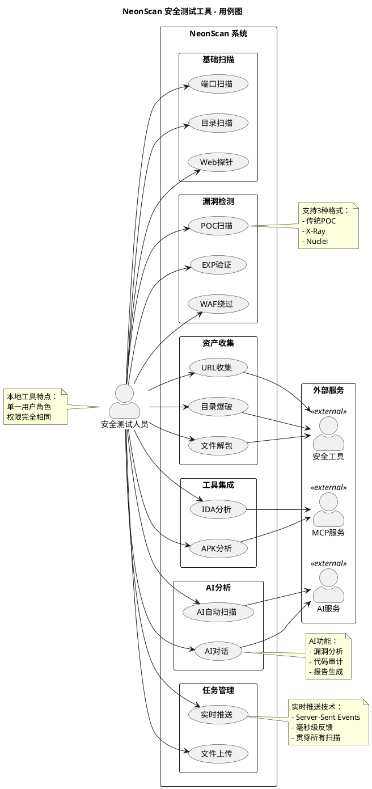

# NeonScan 安全测试工具 - 用例图（简化版）

## PlantUML 用例图代码



---

## 📋 核心功能说明

### 6大功能模块（15个核心用例）

| 模块 | 用例 | 说明 |
|------|------|------|
| **基础扫描** | 端口扫描 | TCP/UDP端口探测 + Banner抓取 |
| | 目录扫描 | Web目录爆破，敏感路径发现 |
| | Web探针 | 指纹识别，技术栈探测 |
| **漏洞检测** | POC扫描 | 多格式POC漏洞检测（传统/X-Ray/Nuclei） |
| | EXP验证 | 漏洞利用脚本自动化验证 |
| | WAF绕过 | WAF检测与6种绕过策略 |
| **资产收集** | URL收集 | URLFinder工具，从JS提取API/路径 |
| | 目录爆破 | FFUF工具，智能目录爆破 |
| | 文件解包 | Packer-Fuzzer，小程序解包分析 |
| **AI分析** | AI对话 | 交互式安全分析（漏洞/代码/报告） |
| | AI自动扫描 | AI驱动的自动化渗透测试 |
| **工具集成** | IDA分析 | 二进制反汇编、函数提取（MCP协议） |
| | APK分析 | APK反编译、组件分析（MCP协议） |
| **任务管理** | 实时推送 | SSE技术，实时进度反馈 |
| | 文件上传 | POC/EXP/二进制文件管理 |

### 外部依赖

- **AI服务**：OpenAI、DeepSeek、Anthropic、Ollama
- **MCP服务**：IDA Pro MCP Server、JADX MCP Server
- **安全工具**：URLFinder、FFUF、Packer-Fuzzer

---

## 🎨 渲染方法

### 在线渲染（最快）
```
1. 访问 https://www.plantuml.com/plantuml/uml/
2. 复制上面的代码
3. 粘贴即可看到图片
4. 右键保存
```

### VS Code预览
```
1. 安装插件 "PlantUML"
2. 打开本文件
3. 按 Alt+D 预览
```

---

## 💡 简化设计说明

### 相比之前的优化：

1. **去掉UC编号** ✅
   - 用例名称更直观（"端口扫描" vs "UC01: 端口扫描"）
   - 代码中使用简短别名（PORT、DIR、AI等）

2. **精简模块** ✅
   - 从37个用例 → 精简到15个核心用例
   - 删除过度细分的子功能（如"二进制分析""反编译分析"）
   - 合并相似功能（如"字典管理"合并到"目录扫描"）

3. **简化外部系统** ✅
   - 不再详细列出8-9个外部系统
   - 简化为3大类：AI服务、MCP服务、安全工具
   - 使用actor图标表示外部依赖

4. **减少关系线** ✅
   - 只保留核心依赖关系
   - 删除复杂的include/extend关系
   - 用户直接连接最常用的功能

5. **精简注释** ✅
   - 只保留3-4个关键技术说明
   - 删除冗长的描述

---

## 📊 答辩使用建议

### PPT展示话术

> "各位老师，这是NeonScan的系统用例图。系统采用**单一角色设计**，符合本地工具特点。
> 
> 功能上分为**6大模块、15个核心用例**：
> - **基础扫描**：端口、目录、Web探针
> - **漏洞检测**：POC、EXP、WAF绕过
> - **资产收集**：集成URLFinder、FFUF、Packer三大工具
> - **AI分析**：智能对话和自动化扫描
> - **工具集成**：通过MCP协议集成IDA和JADX专业工具
> - **任务管理**：SSE实时推送贯穿所有任务
> 
> 核心技术亮点是**SSE实时推送**和**MCP协议集成**，这是传统安全工具所不具备的。"

### 论文引用

**第3章 需求分析**：
```
如图3.1所示，系统共包含15个核心用例，分为6大功能模块...
```

**第4章 系统设计**：
```
系统采用模块化设计，各模块职责清晰：
- 基础扫描模块负责端口、目录、Web指纹探测
- 漏洞检测模块支持POC/EXP多格式漏洞验证
- AI分析模块集成多种AI Provider...
```

---

## ✅ 简化效果对比

| 维度 | 之前版本 | 简化版 | 效果 |
|------|---------|--------|------|
| **用例数量** | 37个 | 15个 | 减少59% ✅ |
| **用例编号** | UC01-UC37 | 无编号 | 更直观 ✅ |
| **外部系统** | 8-9个详细列出 | 3大类概括 | 更简洁 ✅ |
| **关系线** | 30+ | 15+ | 更清晰 ✅ |
| **注释** | 6-7个 | 3个核心 | 更聚焦 ✅ |
| **视觉复杂度** | 高 | 中 | 易读性提升 ✅ |

---

## 🎯 总结

这个简化版用例图：
- ✅ **保留了功能完整性**（6大模块全覆盖）
- ✅ **去掉了UC编号**（更自然）
- ✅ **精简到15个核心用例**（减少视觉负担）
- ✅ **简化了外部依赖**（3大类概括）
- ✅ **适合答辩展示**（5分钟内讲清楚）

可以直接用于毕业论文和答辩PPT！🎉
